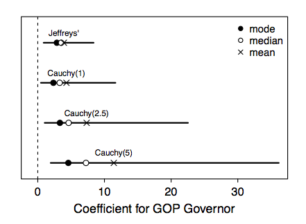

Manuscript, code, and data for the paper titled "Dealing with Separation in Logistic Regression Models."

Here's the main point:

When dealing with separation under logistic regression, you had better choose your prior distribution carefully--your choice will (most likely) affect your inferences. To see how, just look at the differences in the posterior summaries from this real data set using four different, but plausible, prior distributions. Note that Jeffreys' prior and the Cauchy(2.5) prior are two *defaults* recommended in the literature, yet the 90% credible interval for the latter is more than *twice as wide* as the former and the posterior mean is almost *twice as large*.

And here is the abstract:

> When facing small numbers of observations or rare events, political scientists often encounter separation, in which explanatory variables perfectly predict binary events or non-events. In this situation, maximum likelihood provides implausible estimates and the researcher might want incorporate some form of prior information into the model. The most sophisticated research uses Jeffreys’ invariant prior to stabilize the estimates. While Jeffreys’ prior has the advantage of being automatic, I show that it often provides too much prior information, producing smaller point estimates and narrower confidence intervals than even highly skeptical priors. To help researchers assess the amount of information injected by the prior distribution, I introduce the concept of a partial prior distribution and develop the tools required to compute the partial prior distribution of quantities of interest, estimate the subsequent model, and summarize the results.

If you have any comments or suggestions, please [open an issue](https://github.com/carlislerainey/priors-for-separation/issues) or just [e-mail](mailto:carlislerainey@gmail.com) me.

To replicate the results, you simply need to run the file `do-all.R`. For ease-of-use, you may wish to set the number of MCMC simulations (and the length of the burnin) to small values. To replicate the results in the paper, you will need to change the `n_sims` and `n_burnin` arguments in the file `do-all.R` to large values, such as 200,000 and 50,000, respectively.
